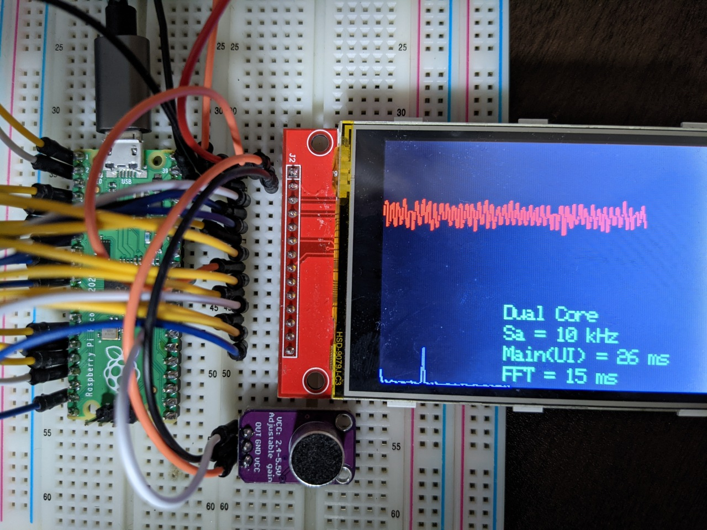

# About
Dual Core Spectrum Analyzer on Raspberry Pi Pico (ADC, DMA, IRQ, SPI, Core0 and Core1)



## Build
```
git clone https://github.com/iwatake2222/pico-work.git
cd pico-work
git submodule update --init
cd pico-sdk && git submodule update --init && cd ..
mkdir build && cd build

# For Windows Visual Studio 2019 (Developer Command Prompt for VS 2019)
# cmake .. -G "NMake Makefiles" -DCMAKE_BUILD_TYPE=Debug -DPICO_DEOPTIMIZED_DEBUG=on
cmake .. -G "NMake Makefiles"
nmake

# For Windows MSYS2 (Run the following commands on MSYS2)
# cmake .. -G "MSYS Makefiles" -DCMAKE_BUILD_TYPE=Debug -DPICO_DEOPTIMIZED_DEBUG=on
cmake .. -G "MSYS Makefiles" 
make
```

## Design:
- Core0:
	- Main thread
		- Initialize ADC (initialization only)
		- Display (SPI) control
		- Touch panel control
	- DMA(ADC) IRQ
		- Store ADC data into buffers
- Core1:
	- Calculate FFT

## Note
- There seems to be a bug as system often freeze!

## Acknowledgements
- fft.cpp
	- http://www.osakac.ac.jp/labs/doi/dsp/fft.c
