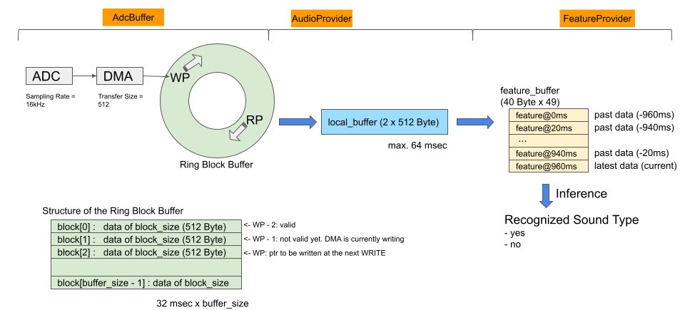
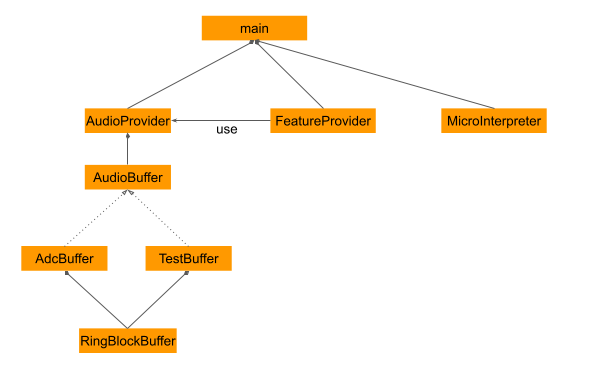

# About
- Simple project for micro_speech
    - Recognize "Yes" / "No"

- Raspberry Pi Pico
    - input = AdcBuffer. Default
    - input = TestBuffer (Voice of Yes)
    - input = Prepared feature data (Yes, No)
- PC ( for debugging )
    - input = TestBuffer (Voice of Yes). Default
    - input = Prepared feature data (Yes, No)

## Build
- Raspberry Pi Pico
    - Follow the steps in README (https://github.com/iwatake2222/pico-work )
    - You may need to change the project to be built and run, or use this commit ( de2704626c7118c5372a30daeb5f207308b88bce )
- PC ( for debugging )
    - Create a project using CMake in this directory
    - A project for Visual Studio 2019 was tested

## Design
### Dataflow

### Software Design

- AudioBuffer:
    - provides an interface to access storead audio data in ring block buffer
- RingBlockBuffer:
    - consists of some blocks. The block size is 512 Byte and the size is equals to DMA's transfer size
    - 512 Byte ( 32 msec @16kHz ) is also convenient to work with FeatureProvider which generates feature data for 30 msec of audio data
- AudioProvider:
    - extracts data from the ring block buffer to the local buffer for the requested time
    - converts data from uint8_t to int16_t
    - allocates the data on sequential memory address
- FeatureProvider:
    - almost the same as the original code

## Performance
- Processing time:
    - Preprocess (retrieving audio data and creating feature data): 8 msec
    - Inference: 61 msec
- Stride for feature data is 20 msec, so 3 ~ 5 slices of feature are drops. It means 70 ~ 110 msec of input voice is missed. Still input voice to generate feature for each process is continuous.
- AudioProvider copies data onto local buffer and converts it from uint8_t to int16_t. It is redundant. However, preprocess time is smaller than inference time and by doing this, I don't need to modify the original code.
 
## Others
- Please read README ( https://github.com/iwatake2222/pico-work ) for other information
